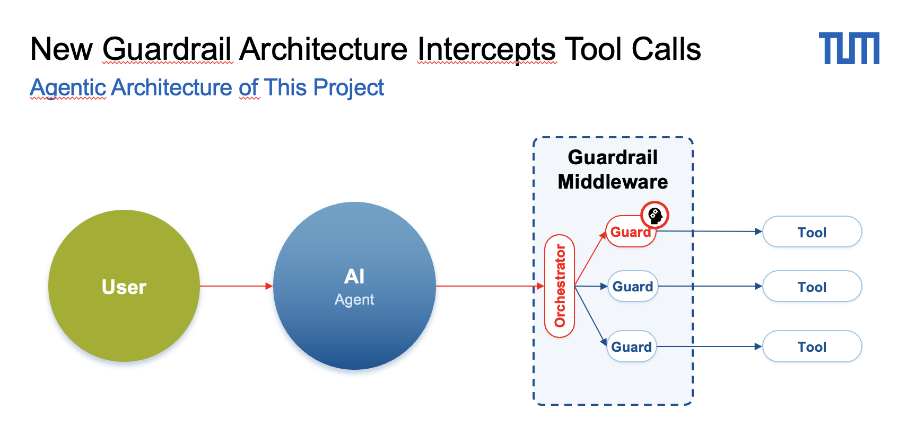

# Guardrail Architecture Evaluation for Compliance Agents

<div align="center">

</div>

> **TU Munich · Entwicklungspraktikum**

---

## Overview

This project evaluates a **guardrail middleware architecture** that intercepts AI agent tool calls at runtime to enforce business policy compliance. Rather than relying on the agent itself to self-regulate, a dedicated guardrail layer sits between the agent and its tools — blocking or allowing each tool call based on domain-specific rules before any side effect occurs.

The central research question is:

> **How effectively does the guardrail architecture reduce the policy violation rate of an AI agent across different customer service scenarios?**

---

## Architecture

```
User  →  AI Agent  →  Guardrail Middleware  →  Tool
                       ┌──────────────────┐
                       │   Orchestrator   │
                       │  ┌────────────┐  │
                       │  │   Guard 1  │──┼──→  Tool A
                       │  ├────────────┤  │
                       │  │   Guard 2  │──┼──→  Tool B
                       │  ├────────────┤  │
                       │  │   Guard N  │──┼──→  Tool C
                       │  └────────────┘  │
                       └──────────────────┘
```

The **Orchestrator** receives every tool call the agent makes and routes it through a pipeline of **Guards**. Each guard is a focused, single-responsibility policy check. Only tool calls that pass all applicable guards are forwarded to the real tool; blocked calls return a structured rejection message back to the agent.

### Guard Types

| Guard | Type | Description |
|-------|------|-------------|
| `flight_status` | Rule-based | Checks flight status before allowing rebooking actions |
| `cancellation_eligibility` | Rule-based | Validates whether a reservation is eligible for cancellation |
| `llm_policy` | LLM-based | Uses an LLM to reason over the full policy and conversation history for complex cases |

Guards implement a two-phase interface:

1. **`applies_to(tool_call)`** — cheap pre-filter; skips guards not relevant to the current tool
2. **`check(tool_call, env, history)`** — full evaluation; returns a `GuardVerdict(allowed, reason)`

The middleware is **fail-open**: if a guard raises an unexpected exception, the tool call is allowed through and the error is logged. This prevents guard bugs from silently blocking all agent actions.

---

## Evaluation

### Metric: Policy Violation Rate

The primary metric is the **policy violation rate** — the fraction of agent actions that violate the domain policy, measured with and without the guardrail layer active. A lower violation rate with guardrails active indicates the architecture is working.

Secondary metrics tracked per run:

- Task completion rate (did the agent resolve the user's request?)
- Guardrail intervention rate (how often did guards fire?)
- False positive rate (how often did guards block a valid action?)

### Evaluation Pipeline

Evaluations are run via the `tau2-bench` simulation framework. A simulated user interacts with the agent over multiple turns; the evaluator scores each trajectory against the ground-truth expected actions and the domain policy.

```
tau2-bench run \
  --domain airline \
  --guardrail-config guardrail_configs/airline_with_llm.json \
  --tasks 50
```

---

## Use Cases

### tau-bench Domains

Evaluation uses established customer service domains from [τ-bench](tau2-bench/README.md):

| Domain | Description |
|--------|-------------|
| `airline` | Flight rebooking, cancellations, seat upgrades |
| `retail` | Order management, returns, refunds |
| `telecom` | Plan changes, tech support, account management |
| `banking_knowledge` | Knowledge-retrieval-based customer service |

### Self-Constructed Scenarios

In addition to the τ-bench task suite, custom scenarios are constructed to specifically stress-test guardrail coverage:

- **Edge cases** — inputs that exploit ambiguity in the policy wording
- **Adversarial requests** — users that try to pressure the agent into bypassing policy
- **Chained violations** — multi-step sequences where each step appears individually valid but the combination violates policy

Custom tasks are stored in [new_data/](new_data/).

---

## Repository Structure

```
COMPLIANCE AGENTS/
├── tau2-bench/               # Forked tau2-bench evaluation framework
│   ├── src/tau2/
│   │   ├── guardrails/       # Guardrail middleware implementation
│   │   │   ├── guard.py           # Abstract Guard base class
│   │   │   ├── middleware.py      # GuardrailMiddleware & SequentialGuardrailMiddleware
│   │   │   └── guards/
│   │   │       ├── flight_status_guard.py
│   │   │       ├── cancellation_guard.py
│   │   │       └── llm_policy_guard.py
│   │   ├── orchestrator/     # Run orchestration logic
│   │   └── domains/          # Domain definitions (policy, tools, tasks)
│   └── guardrail_configs/    # Guardrail pipeline configurations (JSON)
│       ├── airline_defaults.json
│       ├── airline_with_llm.json
│       └── null.json         # Baseline: no guardrails
├── new_data/                 # Self-constructed evaluation tasks
│   └── Airline/
└── viewer/                   # Trajectory viewer UI
```

---

## Getting Started

### Prerequisites

- Python `>=3.12, <3.14`
- [`uv`](https://github.com/astral-sh/uv) for dependency management

### Install

```bash
cd tau2-bench
uv sync
```

### Configure

Set your API keys in `tau2-bench/.env` (copy from `.env.example`).

Choose or create a guardrail config in `guardrail_configs/`. Use `null.json` for a no-guardrail baseline run.

### Run a Baseline (no guardrails)

```bash
cd tau2-bench
tau2 run --domain airline --guardrail-config guardrail_configs/null.json
```

### Run with Guardrails

```bash
tau2 run --domain airline --guardrail-config guardrail_configs/airline_with_llm.json
```

### Policy Tool Mapper

First you have to normaliue the tool.py file to a json & then run the policy mappe 
```bash
cd "./policy_tool_mapper" && pip install -e .

cd tau2-bench
uv run python policy_tool_mapper/build_tools_json.py \
  --tools-file src/tau2/domains/airline/tools.py

policy-map \
  --policy  ./input/airlinePolicy.md \
  --openapi ./input/airlineTools.json \
  --output  ./output/airline-mappings.json \
  --model gpt-4.1-mini

```


### View Trajectories

```bash
cd viewer
python server.py
```

---

## Guardrail Configuration Format

Guardrail pipelines are defined as JSON:

```json
{
  "type": "sequential",
  "guards": [
    { "type": "flight_status" },
    { "type": "cancellation_eligibility" },
    {
      "type": "llm_policy",
      "llm": "gpt-4.1-mini",
      "tool_names_filter": ["cancel_reservation"],
      "history_window": 10
    }
  ]
}
```

The `sequential` orchestrator evaluates guards in order; the first block wins.

---

## Related Work

- [τ-bench](https://arxiv.org/abs/2506.07982) — Benchmark for Tool-Agent-User Interaction
- [τ³-bench](https://arxiv.org/abs/2603.13686) — Extension with voice and knowledge domains
- [SABER](https://arxiv.org/abs/2512.07850) — Task quality analysis for τ-bench
